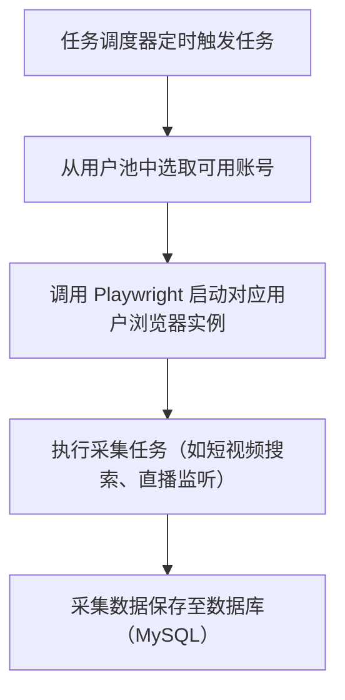
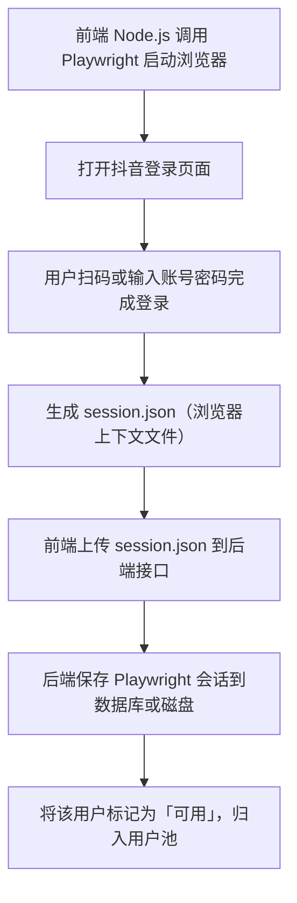

# Caesar 后端项目文档

Caesar 是一个多模块的 Java 后端系统，聚焦于 **自媒体数据采集、实时直播监控与签名机制逆向实现**。系统以抖音直播数据为核心目标，采用模块化设计，便于功能拆分与拓展，支持从 WebSocket 消息监听到视频流录制的全流程处理。

---

## 📌 项目概述

- **项目名称**：caesar
- **项目类型**：Java 多模块应用
- **应用场景**：自媒体数据采集、用户行为监听、WebSocket 消息解析、直播录制、系统探针监控等
- **设计理念**：模块解耦、统一异常处理、结构化日志、可视化监控、支持逆向与协议解析
- **前端地址**：[caesar-admin](https://github.com/TyresePeng/caesar-admin)

---

## 🎯 功能亮点与规划（caesar-media）

## 🔁 Caesar-Media 核心流程图（用户登录与数据采集）

<div style="display: flex; gap: 20px;">

<div style="flex: 1;">
<details>
<summary>🧩 后端流程</summary>


</details> 
</div> 

<div style="flex: 1;"> 
<details> 
<summary>🖥️ 前端流程</summary>


</details> 
</div> 
</div>


### ✅ 已实现功能
1. **用户池管理（抖音平台）**
    - 前端上传已登录的抖音浏览器实例文件（Playwright 格式）
    - 后端解析并保存浏览器会话信息（如 Cookies、Storage）至数据库
    - 支持账号状态监控（如过期检测），集中管理登录用户
    - 用户池用于后续任务调度时按需分配可用账号

2. **任务管理（短视频采集）**
    - 支持自定义任务参数配置（关键词、平台类型、页数、爬取频率等）
    - 支持任务的批量提交、状态追踪与历史结果查看
    - 后台调度 Playwright 自动轮询用户池中的账号，执行采集任务

3. **抖音直播能力暴露**
    - **实时弹幕展示**：连接直播 WebSocket，接收弹幕内容并展示
    - **录制控制**：通过 FFmpeg 拉流直播，支持一键开始/停止录制，保存为本地 MP4 文件
    - **关键词查询**：支持对直播消息中的关键内容进行搜索与提取
---

### 🚧 未来规划功能

- **任务系统扩展**
    - 支持多平台接入（如小红书、TikTok）
    - 扩展任务类型：如短视频评论采集、自动发布短视频等

- **IP代理功能**
    - 为请求添加代理，一个帐号分配一个IP代理

- **AI 能力接入**
    - 实现 AI 驱动的弹幕自动回复功能，提升互动效率
    - 引入弹幕语义分析与情感识别，辅助直播分析
    - 结合大模型分析观众活跃度、内容偏好趋势

- **智能监控与诊断（caesar-agent 集成）**
    - 引入 AI 驱动的异常监控、日志分析与自动告警
    - 实现链路追踪、请求耗时分析与瓶颈定位能力

---

## 🧩 模块功能说明

### `caesar-agent` – 系统探针模块

提供运行时监控能力，包括接口日志、JVM 状态、错误上报等，未来将集成 AI 智能告警与链路追踪。

**功能亮点：**

- 请求日志采集（支持路径、方法、参数、响应等）
- JVM 指标采集（内存、线程、GC 等）
- 异常事件发布（如 SystemErrorEvent）
- 可扩展的探针接口和 Hook 插件机制

---

### `caesar-boot-start` – 应用启动模块

统一配置系统初始化逻辑，封装日志中间件、异常处理、拦截器、验签机制等公共能力。

**功能亮点：**

- 日志输出结构化（logbook + logstash）
- 全局异常处理（基于 `@ControllerAdvice`）
- Feign 拦截与日志追踪
- 请求验签机制（防篡改、防重放）
- 启动入口集成模块注册

---

### `caesar-common` – 通用模块

提供公共工具、常量、异常封装，供各业务模块引用。

**包含内容：**

- 工具类：字符串、JSON、日期、HTTP、文件等
- 异常封装：统一异常体系
- 常量定义：日志字段、错误码、系统参数
- ThreadLocal 封装：支持异步上下文透传

---

### `caesar-example-test` – 示例模块

提供开发调试样例，包括接口调用、WebSocket 消息模拟、录制触发等场景。

---

### `caesar-media` – 媒体核心模块

该模块为业务核心，聚焦于直播数据逆向、实时监听与流录制等功能。

**功能亮点：**

- 基于 Playwright 获取 WebSocket 地址、Cookies、User-Agent 等参数
- 建立抖音直播间 WebSocket 连接，监听消息（弹幕、点赞、送礼等）
- 消息解析采用 Protobuf，适配新版抖音消息结构
- 数据持久化存储（MySQL）
- 调用 FFmpeg 实现直播流录制（生成 MP4）
- 支持定时任务调度、自动断线重连、状态控制

**核心技术：**

- Playwright 控制浏览器
- WebSocket 消息监听（基于 okhttp-websocket）
- FFmpeg CLI 录制与转码
- 协议解析使用 Protobuf

---

## 🛠️ 技术栈概览

| 类别    | 技术栈                                       |
|-------|-------------------------------------------|
| 编程语言  | Java 1.8                                  |
| 框架    | Spring Boot, MyBatis-Plus, Feign, Quartz  |
| 构建工具  | Maven                                     |
| 数据库   | MySQL                                     |
| 日志系统  | Logback, Logstash, Logbook                |
| HTTP 客户端 | OkHttp, Feign                             |
| 浏览器自动化 | Playwright                                |
| WebSocket | okhttp-ws                                 |
| 视频处理  | FFmpeg                                    |
| 协议解析  | Protocol Buffers                          |
| 容器    | docker                                    |

---

## 📁 项目结构（简要）

```
caesar/
├── caesar-agent/            # 探针模块：接口日志、JVM 监控、错误事件
├── caesar-boot-start/       # 启动模块：日志、异常、验签、Feign 拦截
├── caesar-common/           # 公共依赖：工具类、常量、异常定义等
├── caesar-example-test/     # 示例模块：接口与任务测试
├── caesar-media/            # 媒体核心：逆向、录制、消息解析
│   ├── client/              # 抖音客户端封装
│   ├── websocket/           # WebSocket 监听与处理
│   ├── service/             # 业务逻辑层
│   ├── utils/               # 工具类（签名、参数等）
│   └── proto/douyin/        # Protobuf 协议定义
└── pom.xml                  # Maven 多模块父项目配置
```

---

## 📝 开发与运行指南

### 开发环境要求

- JDK 1.8+
- Maven 3.6+
- MySQL 5.7+/8.x（持久化用）
- FFmpeg（命令行可用）
- Node.js（Playwright 控制浏览器时需要）

### 启动方式

```bash
# 编译全项目
mvn clean install

# 启动主模块
```

---

### 打包运行方式

```bash
# 自行安装docker环境 docker-compose 命令
# 1. 编译整个多模块 Maven 项目（跳过测试）
mvn clean package -DskipTests

# 2. 进入 caesar-media 模块目录
cd caesar-media

# 3. 构建 Docker 镜像（可自定义镜像名称）
docker build -t caesar-media:latest .

# 4. 使用 docker-compose 启动服务（后台运行）
docker-compose up -d

```

---

## 📬 联系与贡献
如有建议、问题或合作意向，可通过 GitHub Issue 提出或私信开发者。欢迎 PR 与共同维护。

如有需求要，请联系：

> **开发者**：Tyrese  
> **邮箱**：tyrese.guo@gmail.com  
> **项目地址**：[GitHub](https://github.com/TyresePeng/caesar)

### 🧑‍💻 微信交流群
扫码添加开发者微信，备注 “Caesar”，邀请进交流群 👇
<table>
  <tr>
    <td style="text-align:center;">
      <br/>
      <strong>微信群二维码</strong>
    </td>
    <td style="text-align:center; padding-left: 20px;">
      <br/>
      <strong>作者微信</strong>
    </td>
  </tr>
</table>
